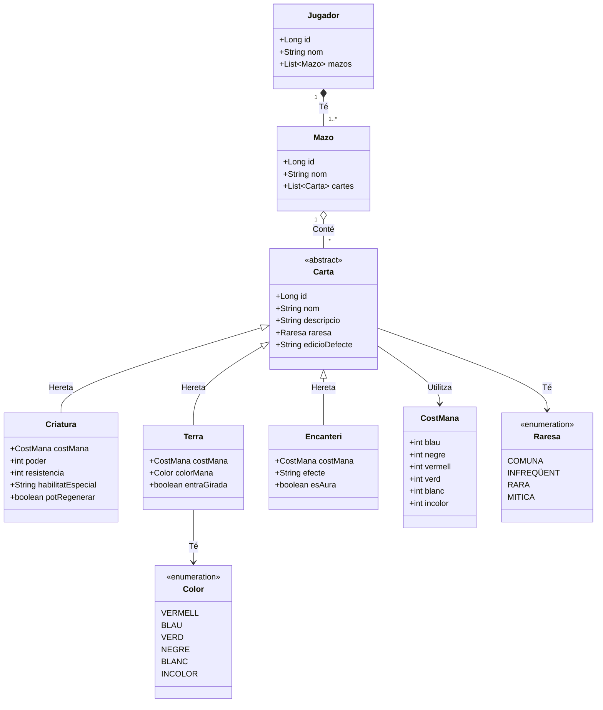

Estructura del projecte:

src/main/java/com/polydeck/engine/
│
├── MagicObjDB_The_Poly_Deck_Engine.java  <-- Classe main (Punt d'entrada i orquestració)
│
├── model/                                <-- Entitats JPA (El Domini)
│   ├── Carta.java                        (Classe abstracta base)
│   ├── Criatura.java                     (Especialització)
│   ├── Terra.java                        (Especialització)
│   ├── Encanteri.java                    (Especialització)
│   ├── CostMana.java                     (Component Incrustat)
│   ├── Mazo.java                         (Agregador polimòrfic)
│   ├── Jugador.java                      (Propietari)
│   └── enums/
│       ├── Raresa.java                   (COMUNA, INFREQÜENT, RARA, MÍTICA)
│       └── Color.java                    (Per a les terres: VERMELL, BLAU, etc.)
│
├── manager/                              <-- Lògica de negoci i persistència
│   └── GestorCartes.java                 (Maneja l'EntityManager i les consultes)
│
└── utils/                                <-- Utilitats auxiliars
    └── LectorFitxers.java                (Per a parsejar 'cartes.txt')

src/main/resources/
│
├── META-INF/
│   └── persistence.xml                   (Configuració d'ObjectDB/JPA)
│
└── data/
    └── cartes.txt                        (Fitxer de càrrega inicial de dades)

> La seguent classe es el diagrama, des de github es pot visualitzar directament, si no hi ha una imatge en assets/Diagrama.png
